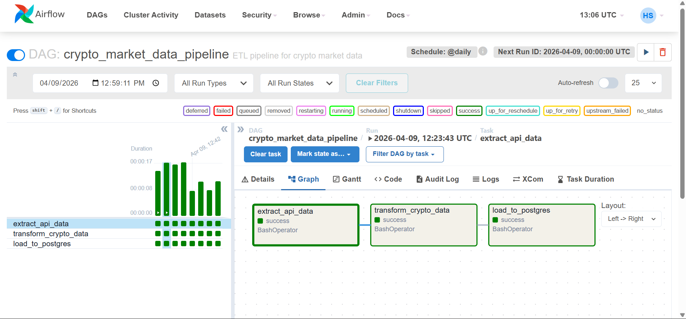
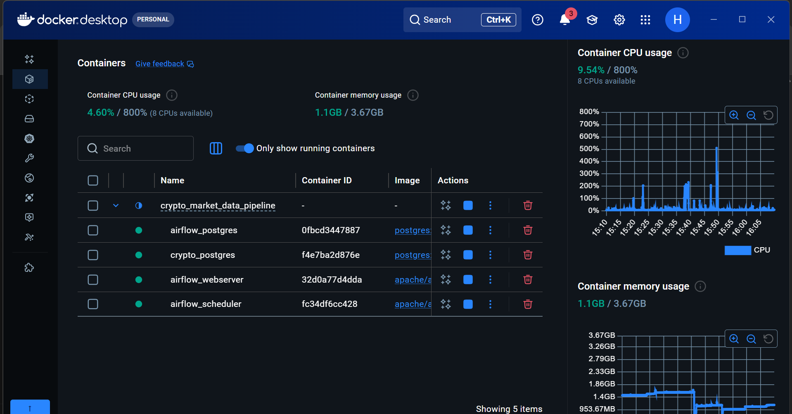
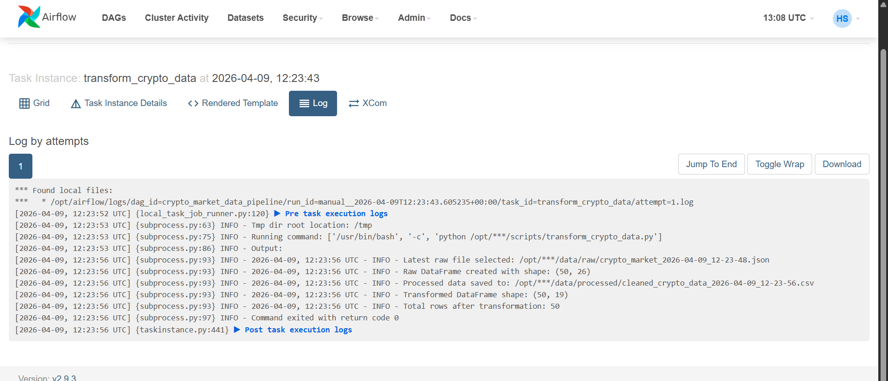

# Crypto Market Data Pipeline (ETL Project)

## Overview

This project is an end-to-end Data Engineering pipeline that extracts cryptocurrency market data from a public API, transforms it into a clean and structured format, and loads it into a PostgreSQL database for analysis.

The pipeline simulates a real-world data workflow and is fully containerized using Docker and orchestrated using Apache Airflow for automated execution..

## Objective

The goal of this project is to build a production-style ETL pipeline that:

- Extracts real-time cryptocurrency data from an external API
- Cleans and transforms data using Python (pandas)
- Stores data in PostgreSQL
- Supports incremental loading (append-only design)
- Tracks historical data using timestamps
- Runs in a reproducible containerized environment using Docker
- Automates execution using workflow orchestration

## Pipeline Architecture

The pipeline follows a layered architecture:

API → Raw JSON → Transformation (pandas) → PostgreSQL

1. Extraction Layer:
   - Fetches crypto market data from CoinGecko API
   - Saves raw JSON files with timestamps

2. Transformation Layer:
   - Converts JSON data into pandas DataFrame
   - Selects relevant columns
   - Cleans data types
   - Adds derived features

3. Load Layer:
   - Loads processed data into PostgreSQL
   - Uses incremental loading (append mode)
   - Preserves historical snapshots

## Containerized Architecture (Docker)

The pipeline is fully containerized using Docker and Docker Compose.

### Services:

- ETL Pipeline Container
  - Runs extraction, transformation, and loading
- PostgreSQL Container
  - Stores processed cryptocurrency data
- Airflow Services (scheduler + webserver + metadata DB)

### Workflow:

Airflow Scheduler
↓
ETL Tasks → PostgreSQL Database

## Workflow Orchestration with Apache Airflow

The pipeline is orchestrated using Apache Airflow

### DAG Structure

The workflow is divided into three tasks:
- extract_api_data
- transform_crypto_data
- load_to_postgres

Task dependency:
Extract → Transform → Load

### Features of Airflow Integration

- Automated task scheduling
- Task dependency management
- Retry mechanism
- Logging and monitoring via UI
- Workflow history tracking

### Scheduling

The pipeline is configured to run automatically:
@daily

## Technologies Used

- Python
- pandas
- requests (API calls)
- PostgreSQL
- SQLAlchemy
- python-dotenv
- logging
- pathlib
- Docker
- Docker Compose
- Apache Airflow

## Project Structure

crypto_market_data_pipeline/
│
├── images/
│ ├── airflow_dag.png 
│ └── docker_container.png
│ └── logs.png 
│
├── data/
│ ├── raw/ 
│ └── processed/ 
│
├── scripts/
│ ├── extract_api_data.py
│ ├── transform_crypto_data.py
│ ├── load_to_postgres.py
│ ├── run_pipeline.py
│
├── dags/
│ └── crypto_pipeline_dag.py
│
├── logs/
├── airflow_logs/
│
├── Dockerfile
├── docker-compose.yml
├── .dockerignore
│
├── .env
├── requirements.txt
├── README.md

## Screenshots

## Airflow DAG Execution

---

## Docker Services

---

## Airflow DAG logs

## Features Implemented

- API data extraction (CoinGecko)
- Raw data storage (JSON layer)
- Data transformation using pandas
- Feature engineering:
  - price_range_24h
  - market_cap_category
  - snapshot_timestamp
- Incremental data loading (append-only)
- Logging per pipeline stage (extract, transform, load, pipeline)
- Environment configuration using `.env`
- Modular pipeline structure
- Docker containerization
- Multi-container orchestration
- Airflow DAG automation
- Scheduled pipeline execution

## Incremental Loading

This pipeline uses an append-only strategy when loading data into PostgreSQL.

Instead of overwriting existing data, each run adds new records with a timestamp:

- Preserves historical data
- Enables time-series analysis
- Reflects real-world data engineering practices

Each record includes a snapshot_timestamp to track when the data was collected.

## How to Run (Local)

1. Install dependencies:
pip install -r requirements.txt

2. Set up environment variables in `.env`

3. Run extraction:
python scripts/extract_api_data.py

4. Run transformation:
python scripts/transform_crypto_data.py

5. Load into PostgreSQL:
python scripts/load_to_postgres.py

## How to Run (Docker)

1. Build and start services:
docker compose up --build

2. To rerun the ETL pipeline:
docker compose run etl_pipeline

3. To stop containers:
docker compose down

### Airflow Execution

1. Start Airflow:
docker compose up -d

2. Open UI:
http://localhost:8080

3. Trigger DAG or wait for scheduled run.

## Example SQL Queries

Check total records:
SELECT COUNT(*) FROM crypto_market_data;

View recent data:
SELECT * FROM crypto_market_data
ORDER BY snapshot_timestamp DESC
LIMIT 10;

Check incremental loading:
SELECT snapshot_timestamp, COUNT(*)
FROM crypto_market_data
GROUP BY snapshot_timestamp
ORDER BY snapshot_timestamp;

## Key Concepts Demonstrated
ETL pipeline design
Incremental data loading
Data layering (raw → processed → DB)
Docker containerization
Service orchestration
Workflow orchestration with Airflow
Scheduling and automation
Logging and monitoring

## Future Improvements
Cloud deployment (AWS / GCP / Azure)
Data warehouse modeling (star schema)
Streaming ingestion (Kafka)
Data quality checks
Dashboard visualization (Power BI / Streamlit)